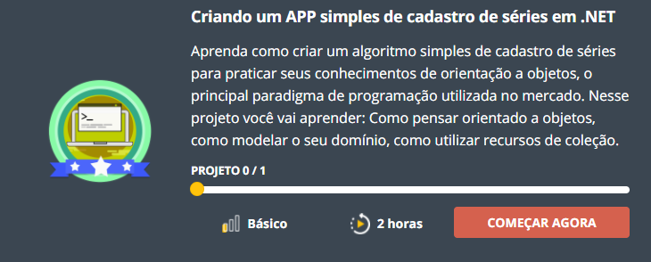

<h1 align="center">Cadastro de Series e 🎞Filmes</h1>

## 📑 Sobre
---
Projeto desenvolvido para o Bootcamp da **DIO (Digital Innovation One)**, onde foi solicitado a criação de uma aplicação de cadastro de Séries e Filmes, via "Console".

---
## 🚀 Tecnologias Utilizadas

O projeto foi desenvolvido utilizando a seguintes tecnologias:

- C#

---

    

